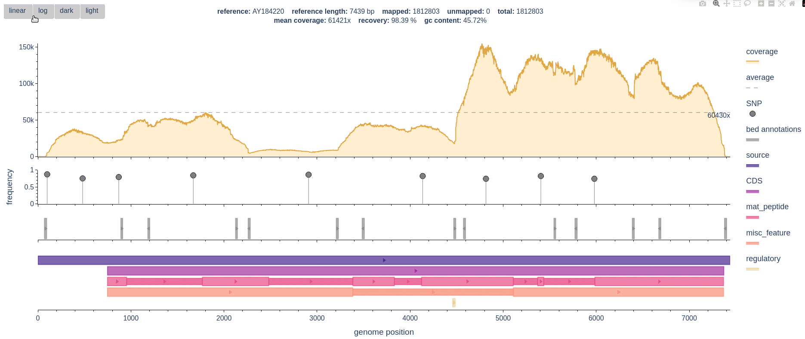

[](https://www.python.org/)
[](https://www.gnu.org/licenses/gpl-3.0)

[](https://zenodo.org/badge/latestdoi/700952196)
[](https://pypi.org/project/bamdash/)
[](https://pypi.org/project/bamdash/)

## Overview

**BAMdash lets you create interactive coverage plots from your bam file with [`plotly`](https://plotly.com/)**

- **requires** only a `.bam`, `.bai` and the reference id to which the reads where mapped
- **create** a interactive `html` for data exploration
- **create** a static image (`jpg`, `png`, `pdf`, `svg`) ready for publication
- **add** additional tracks (supported: `.vcf`, `.gb`, `.bed`)
- **annotate** tracks with coverage data and vcf with additional information if a `.gb` file is provided
- **export** annoated track data as tabular files (`.bed`, `.vcf`) or json (`.gb`)
- **developed** for viral genomics
- **customize** all plotting parameters

**Feel free to report any bugs or request new features as issues!**

## Example


## Installation

### via pip (recommened):
```shell
pip install bamdash
```
### from this repo:
```shell
git clone https://github.com/jonas-fuchs/BAMdash
cd BAMcov
```
and then install BAMdash with:
```shell
pip install -r requirements.txt
```
or:
```shell
pip install .
```
That was already it. To check if it worked:

```shell
bamdash -v
```
You should see the current BAMdash version.

## Usage

```shell
usage: 	

bamdash -b bam_file_path -r reference_id [additional arguments]
```
```
full usage:

  -h, --help            show this help message and exit
  -b  , --bam           bam file location
  -r  , --reference     seq reference id
  -t [track_1 ...], --tracks [track_1 ...]
                        file location of tracks
  -c 5, --coverage 5    minimum coverage
  --slider, --no-slider
                        show slider (default: False)
  -e None, --export_static None
                        export as png, jpg, pdf, svg
  -d px px, --dimensions px px
                        width and height of the static image in px
  --dump, --no-dump     dump annotated track data (default: False)
  -v, --version         show program's version number and exit
```

## Cutomization

BAMcov plotting settings can be adjusted in in the `config.py`. Therefore, you have to clone this repo.

Go to the configs location:
```shell
cd BAMdash/bamdash/scripts/
```
And open the `config.py` with a text editor, e.g.:
```shell
gedit config.py
```
and adjust the settings:
```python
# pdf settings
show_log = True

# overall layout
vcf_track_proportion = 0.3
gb_track_proportion = 0.5
bed_track_proportion = 0.2
plot_spacing = 0.05

# coverage customize
coverage_fill_color = "rgba(255, 212, 135, 0.2)"
coverage_line_color = "rgba(224, 168, 68, 1)"
average_line_color = "grey"
average_line_width = 1

# track customize
track_color_scheme = "agsunset"  # for mutiple annotations tracks (genebank)
track_color_single = "rgb(145, 145, 145)"  # for single tracks (any rgb value, but no named colors)
strand_types = ["triangle-right", "triangle-left", "diamond-wide"]  # +, -, undefined strand
strand_marker_size = 8
strand_marker_line_width = 1
strand_marker_line_color = "rgba(0, 0, 0, 0.2)"
box_bed_alpha = [0.6, 0.6]  # alpha values for boxes (bed)
box_bed_size = [0.4, 0.4]  # size values for boxes (bed)
box_gb_alpha = [0.6, 0.8]  # alpha values for boxes (gb)
box_gb_size = [0.4, 0.3]  # size values for boxes (gb)

# variant customize
variant_marker_size = 13
variant_marker_line_width = 1
variant_line_color = "black"
stem_color = "grey"
stem_width = 1
snp_color = "grey"
ins_color = "blue"
del_color = "red"
```
To apply these new settings just repeat the installation procedure in the BAMdash dir:
```shell
pip install .
```

<a href="https://www.buymeacoffee.com/jofox" target="_blank"></a>


---

**Important disclaimer:**
*The code is under the GPLv3 licence. The code is WITHOUT ANY WARRANTY; without even the implied warranty of MERCHANTABILITY or FITNESS FOR A PARTICULAR PURPOSE. This program is free software: you can redistribute it and/or modify it under the terms of the GNU General Public License as published by the Free Software Foundation, either version 3 of the License, or
(at your option) any later version.*
