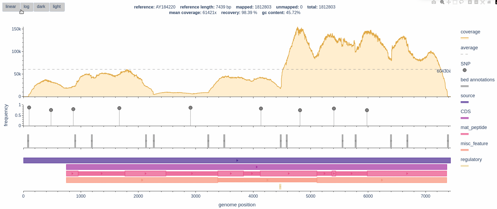

[](https://www.python.org/)
[](https://www.gnu.org/licenses/gpl-3.0)

[](https://zenodo.org/records/17913086)
[](https://pypi.org/project/bamdash/)
[](https://pypi.org/project/bamdash/)
[](https://anaconda.org/bioconda/bamdash)
[](https://anaconda.org/bioconda/bamdash)

## Overview

**BAMdash lets you create interactive coverage plots from your bam file with [`plotly`](https://plotly.com/)**

- **requires** only a `.bam`
- **create** a interactive `html` for data exploration
- **create** a static image (`jpg`, `png`, `pdf`, `svg`) ready for publication
- **add** additional tracks (supported: `.vcf`, `.gb`, `.bed`)
- **plot** multiple references in a single `html` with a dropdown to switch between them
- **annotate** tracks with additional information
- **export** annoated track data as tabular files (`.bed`, `.vcf`) or json (`.gb`)
- **customize** all plotting parameters

**Feel free to report any bugs or request new features as issues!**


## Automatic annotation

BAMdash automatically computes serveral statistics:

- if `-bs` is > 1 it computes the mean over the bin size in the coverage plot
- for each track it computes recovery and mean coverage (set `-c` for the min coverage) for each element in the track
- if a `*.vcf` is provided it annotates `TRANSITION`/`TRANSVERSION` and type of exchange (`SNP`, `DEL`, `INS`)

If a `*.gb`and `*.vcf` is provided BAMdash computes if the mutations could have been caused by APOBEC deamination. 
Moreover, it annotates the aminoacid exchange and the effect in the CDS (inspired by but not as powerful as [snpeff](http://pcingola.github.io/SnpEff/snpeff)). SNP and INDEL vcf annotation supports:

- `START_LOST`: INDEL or SNP start at the CDS and result in a start loss
- `STOP_LOST`: INDEL or SNP result in the loss of the stop codon
- `STOP_GAINED`: INDEL or SNP result in an additional stop codon
- `SYN`: SNP does not lead to an amino acid change
- `NON-SYN`: SNP leads to an amino acid change 
- `AC_INSERTION`: INS that does not change already present amino acids
- `AC_CHANGE+AC_INSERTION`: INS where the affected codon is also non-syn
- `AC_DELETION`: DEL that does not change already present amino acids
- `AC_CHANGE+AC_DELETION`: DEL where the affected codon is also non-syn
- `FRAMESHIFT`: INDEL that leads to a frameshift

The nomenclature for the aminoacid effect is pretty simplified:

- `A58Y` - Exchange at pos 58 from A to Y
- `A58YY`- Exchange at pos 58 from A to Y and insertion of an additional Y
- `AF58Y`- Exchange at pos 58 from A to Y and deletion of the following F
- `A58fsX` - Frameshift at pos 58

## Example


## Installation

### via pip (recommened):
```shell
pip install bamdash
```
### via conda:
```shell
conda install -c bioconda bamdash
```
### For development:
```shell
git clone https://github.com/jonas-fuchs/BAMdash
cd BAMdash
pip install .
```
```shell
bamdash -v
```
You should see the current BAMdash version.

## Usage

```shell
usage: 	

bamdash -b bam_file_path [additional arguments]
```
```
full usage:

  -h, --help            show this help message and exit
  -b BAM, --bam BAM     bam file location
  -r [REF_ID ...], --ref-id [REF_ID ...]
                        seq reference id(s); default: all references in bam.
                        When more than one reference is plotted, the output html
                        contains a dropdown to switch between references.
  -p ./plot, --prefix ./plot
                        path and partial filename for output files
  -s [html ...], --suffix [html ...]
                        output file extensions appended to prefix (allowed:
                        html, png, jpg, jpeg, webp, svg, pdf, eps)
  -q 15, --quality-threshold 15
                        quality threshold for reads
  -bs N, --binsize N    bins for the coverage plot
  -t [track_1 ...], --tracks [track_1 ...]
                        file location of tracks (accepted: *.vcf, *.bed, *.gb)
  -c 5, --coverage 5    minimum coverage
  --slider, --no-slider
                        show slider (default: False)
  --offline, --no-offline
                        inline the plotly.js bundle into the output html so
                        the file is fully usable without an internet
                        connection (default: True). Use --no-offline to load
                        plotly.js from a CDN instead, which produces a much
                        smaller html file but requires internet access to view
  --custom-config TOML  path to a user-supplied TOML config file whose
                        settings override the shipped defaults (see
                        config.toml). Only the keys present in the file are
                        overwritten; all others keep their default values
  -d px px, --dimensions px px
                        width and height of static (non-html) output in px
                        (default: 1920 1080; ignored when only html is
                        requested)
  --dump, --no-dump     dump annotated track data; filenames derive from
                        --prefix (default: False)
  --verbose             increase logging verbosity: --verbose for INFO,
                        --verbose --verbose for DEBUG
  -v, --version         show program's version number and exit
```

## Test BAMdash

- download the HEV example data:
https://zenodo.org/api/records/10159816/files-archive 
- extract data, cd to folder and use bamdash:

```shell
bamdash -b HEV.bam -r HEV-pat-1 -t HEV.vcf HEVprim.bed HEVamp.bed HEV.gb
```

## Multiple references

By default BAMdash now plots **all** references found in the bam header. When
more than one reference is plotted, the output `html` contains a **dropdown
menu** to switch between the per-reference figures. Each reference gets its own
figure showing only the tracks that contain data for that reference, so a
single multi-reference `.vcf` or `.bed` file is automatically split across the
references it contains.

```shell
# plot every reference in the bam (dropdown in the output html)
bamdash -b multi.bam -t variants.vcf regions.bed

# plot a subset of references
bamdash -b multi.bam -r refA refB -t variants.vcf regions.bed

# a single reference still produces a plain plotly html (no dropdown)
bamdash -b multi.bam -r refA -t variants.vcf regions.bed
```

Static image export (e.g. `--suffix png`) writes one image per reference as
`{prefix}_{ref}.{suffix}` when multiple references are plotted (a single
reference keeps the original `{prefix}.{suffix}` name). Likewise `--dump`
writes per-reference sidecars (`{prefix}_{ref}_bam_stats.tabular`, etc.).

The master `html` inlines the plotly.js bundle once, so it is fully usable
offline.


## Customization

BAMdash plotting settings are defined in a TOML config file. The shipped
defaults live in [`bamdash/scripts/config.toml`](bamdash/scripts/config.toml).
You can override individual settings without modifying the package by supplying
your own TOML file via `--custom-config`. Only the keys present in your file
are overwritten; all others keep their default values.

1. Copy the shipped `config.toml` and adjust the values you want to change:

```shell
cp bamdash/scripts/config.toml my_config.toml
$EDITOR my_config.toml
```

```toml
# example: only override coverage colors and the SNP marker color
coverage_fill_color = "rgba(0, 100, 200, 0.3)"
coverage_line_color = "rgba(0, 100, 200, 1)"
snp_color = "purple"
```

2. Run bamdash with `--custom-config`:

```shell
bamdash -b HEV.bam -r HEV-pat-1 -t HEV.vcf --custom-config my_config.toml
```

All available settings and their default values are documented in the shipped
[`config.toml`](bamdash/scripts/config.toml). Unknown keys are rejected with an
error so typos do not get silently ignored.

---

**Important disclaimer:**
*The code is under the GPLv3 licence. The code is WITHOUT ANY WARRANTY; without even the implied warranty of MERCHANTABILITY or FITNESS FOR A PARTICULAR PURPOSE. This program is free software: you can redistribute it and/or modify it under the terms of the GNU General Public License as published by the Free Software Foundation, either version 3 of the License, or
(at your option) any later version.*
